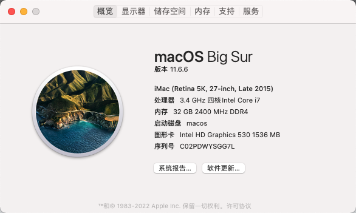
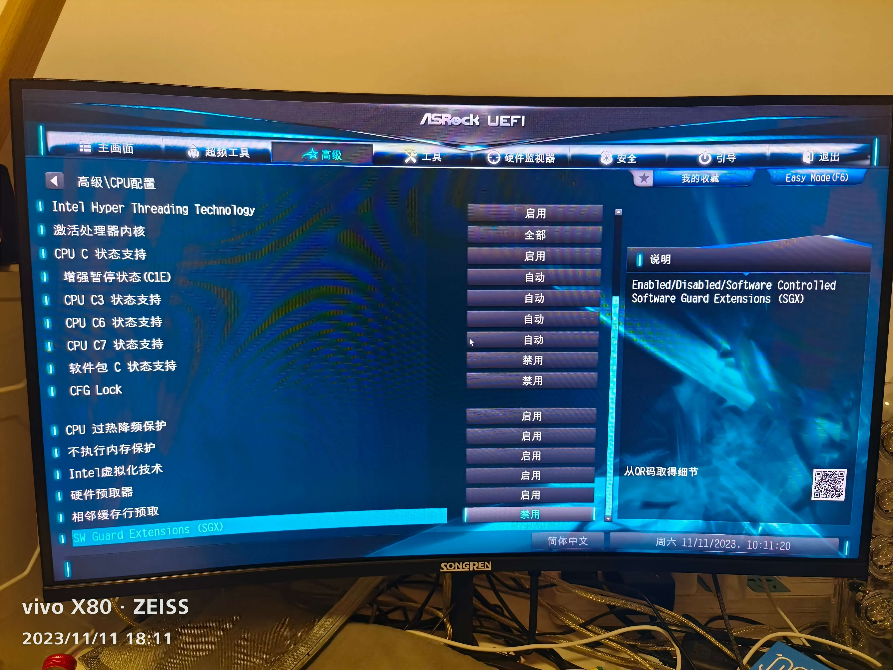
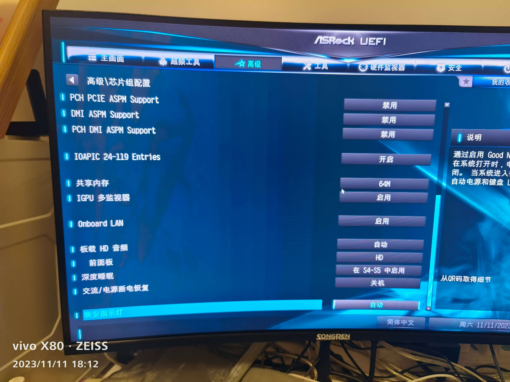
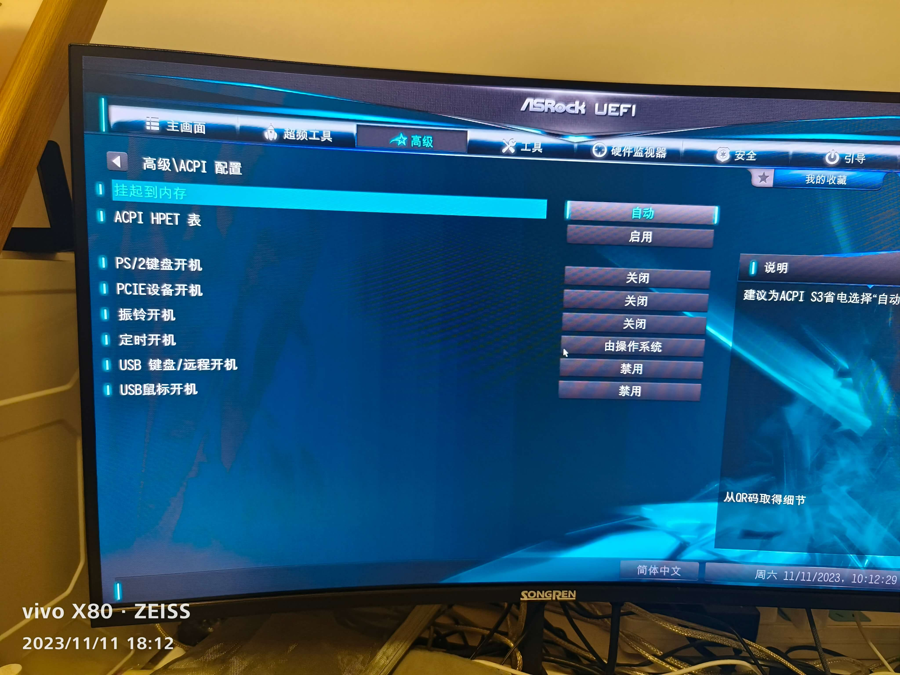
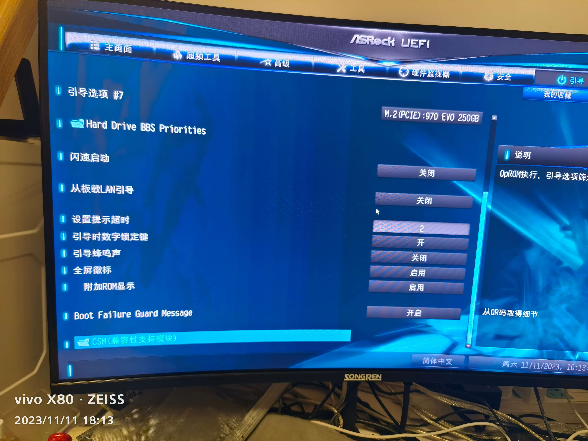

华擎 AsRock Z170 Steel Legend 钢铁传奇¶
「高级」-「CPU 配置」-「Intel Hyper Threading Technology」-「开启」
「高级」-「CPU 配置」-「CFG Lock」-「关闭」
「高级」-「CPU 配置」-「Software Guard Extensions（SGX）」-「关闭」
「高级」-「芯片组配置」-「Above 4G Decoding」-「启用」
「高级」-「芯片组配置」-「VT-d」-「禁用」
「高级」-「芯片组配置」-「共享内存」-「64MB」
「高级」-「芯片组配置」-「IGPUA 多监视器」-「启用」
「高级」-「芯片组配置」-「深度睡眠」-「在 S4-S5 中启用」
「高级」-「存储 配置」-「SATA 模式选择」-「AHCI」
「高级」-「Intel(R) Thunderbolt」-「Discrete Thunderbolt(TM) Support」-「关闭」
「高级」-「ACPI 配置」-「挂起到内存」-「自动」
「高级」-「ACPI 配置」-「USB 键盘/远程开机」-「Disabled」
「高级」-「ACPI 配置」-「USB 鼠标开机」-「Disabled」
「高级」-「USB 配置」-「XHCI Hand-off」-「Enabled」
「安全」-「Secure Boot」-「安全引导」-「关闭」
「安全」-「Intel(R) Platform Trust Technology」-「禁用」
「引导」-「闪速启动」-「关闭」
「引导」-「CSM」-「关闭」
